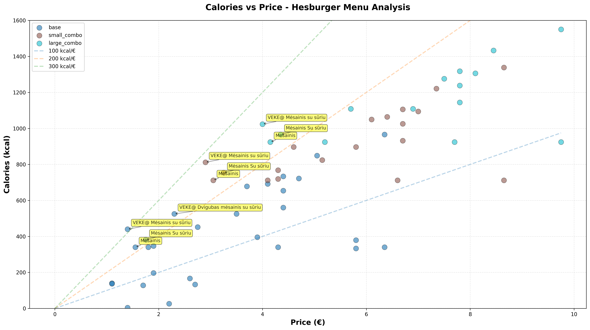
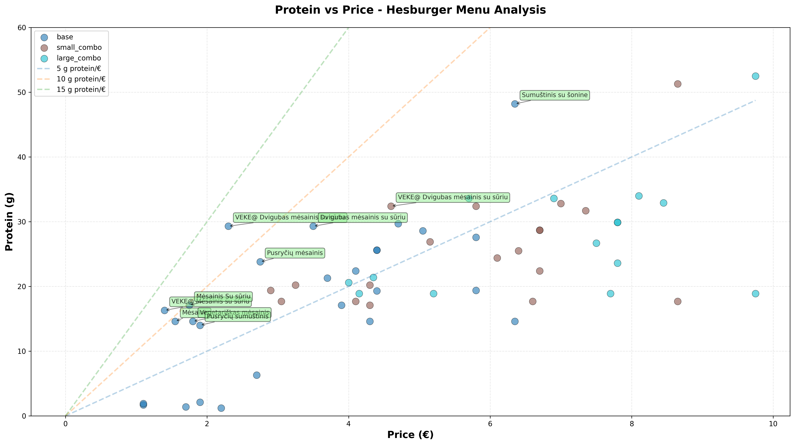

# Finding the best calorie (or protein) to cost ratio in the Hesburger menu

## Project Overview

This project analyzes the Hesburger menu to find the best value deals based on nutritional content and pricing. The analysis combines web scraping, OCR, data processing, and visualization to identify which menu items offer the most calories and protein per euro spent.

## Features

- **PDF Download & OCR**: Automatically downloads the latest menu PDF and extracts text using OCR
- **Web Scraping**: Scrapes nutritional information from Hesburger's website
- **Data Matching**: Intelligently matches menu items with their nutritional data
- **Value Analysis**: Calculates calories per euro and protein per euro for each item
- **Visualization**: Generates comprehensive plots showing the relationship between price and nutritional content
- **Assumptions**: Assumes, that you selected Coca-cola as the drink for your combo.

## Requirements

### Required Libraries

```bash
pip install pandas numpy matplotlib requests beautifulsoup4 easyocr pymupdf pillow
```

**Core Libraries:**
- `pandas` - Data manipulation and analysis
- `numpy` - Numerical operations
- `matplotlib` - Data visualization
- `requests` - HTTP requests for web scraping
- `beautifulsoup4` - HTML parsing for web scraping
- `easyocr` - Optical character recognition
- `pymupdf` (fitz) - PDF processing
- `pillow` (PIL) - Image processing

## Installation & Setup

1. Clone or download this repository
2. Create a virtual environment (recommended):
   ```bash
   python -m venv venv
   source venv/bin/activate  # On Linux/Mac
   # or
   venv\Scripts\activate  # On Windows
   # or you can use Conda like we did in lectures, venv was just preinstalled for me
   ```
3. Install required packages:
   ```bash
   pip install pandas numpy matplotlib requests beautifulsoup4 easyocr pymupdf pillow
   ```

## Usage

Run the complete analysis pipeline:

```bash
cd scripts
python analysis.py
```

The script will:
1. Download the menu PDF (if not already present)
2. Extract text using OCR
3. Parse menu items and prices
4. Scrape nutritional information
5. Match prices with nutritional data
6. Generate analysis plots

## Results

### Top 10 Best Deals by Calories per Euro

| Item Name | Type | Price (€) | Calories (kcal) | Protein (g) | kcal/€ |
|-----------|------|-----------|-----------------|-------------|--------|
| VEKE Mėsainis su sūriu | base | 1.40 | 440 | 16.3 | 314.29 |
| VEKE Mėsainis su sūriu | small_combo | 2.90 | 812 | 19.4 | 280.00 |
| VEKE Mėsainis su sūriu | large_combo | 4.00 | 1024 | 20.6 | 256.00 |
| Mėsainis | small_combo | 3.05 | 712 | 17.7 | 233.44 |
| Mėsainis Su sūriu | small_combo | 3.25 | 754 | 20.2 | 232.00 |
| VEKE Dvigubas mėsainis su sūriu | base | 2.30 | 525 | 29.3 | 228.26 |
| Mėsainis | large_combo | 4.15 | 924 | 18.9 | 222.65 |
| Mėsainis Su sūriu | large_combo | 4.35 | 966 | 21.4 | 222.07 |
| Mėsainis | base | 1.55 | 340 | 14.6 | 219.35 |
| Mėsainis Su sūriu | base | 1.75 | 382 | 17.1 | 218.40 |

### Top 10 Best Deals by Protein per Euro

| Item Name | Type | Price (€) | Calories (kcal) | Protein (g) | g protein/€ |
|-----------|------|-----------|-----------------|-------------|-------------|
| VEKE Dvigubas mėsainis su sūriu | base | 2.30 | 525 | 29.3 | 12.74 |
| VEKE Mėsainis su sūriu | base | 1.40 | 440 | 16.3 | 11.64 |
| Mėsainis Su sūriu | base | 1.75 | 382 | 17.1 | 9.77 |
| Mėsainis | base | 1.55 | 340 | 14.6 | 9.42 |
| Pusryčių mėsainis | base | 2.75 | 452 | 23.8 | 8.65 |
| Dvigubas mėsainis su sūriu | base | 3.50 | 525 | 29.3 | 8.37 |
| Vegetariškas mėsainis | base | 1.80 | 340 | 14.6 | 8.11 |
| Sumuštinis su šonine | base | 6.35 | 966 | 48.2 | 7.59 |
| Pusryčių sumuštinis | base | 1.90 | 347 | 14.0 | 7.37 |
| VEKE Dvigubas mėsainis su sūriu | small_combo | 4.60 | 897 | 32.4 | 7.04 |

### Key Insights

1. **Best Overall Value (Calories)**: The basic burger items ("Mėsainis") offer the best caloric value, especially when ordered as part of combo meals
2. **Best Protein Value**: The VEKE (vegetarian) double burger with cheese provides excellent protein value at 12.74g per euro
3. **Budget-Friendly Options**: Base burgers (without combos) typically offer better value than combo meals when considering pure nutritional content

### Generated Visualizations

The analysis generates two main plots:

#### Calories vs Price Analysis



Scatter plot showing calories vs price with reference lines for different kcal/€ ratios. Best deals are highlighted with labels.

#### Protein vs Price Analysis



Scatter plot showing protein content vs price with reference lines for different g protein/€ ratios. Best protein deals are highlighted.

## Data Sources

- **Menu Prices**: Hesburger Lithuania menu PDF (November 2025)
- **Nutritional Information**: Scraped from https://www.hesburger.lt/maistin---vert---ir-alergenai

## License

This project is licensed under the GNU General Public License v3.0 (GPL-3.0).

For the full license text, see: https://www.gnu.org/licenses/gpl-3.0.en.html

## Author

Laurynas Agejevas